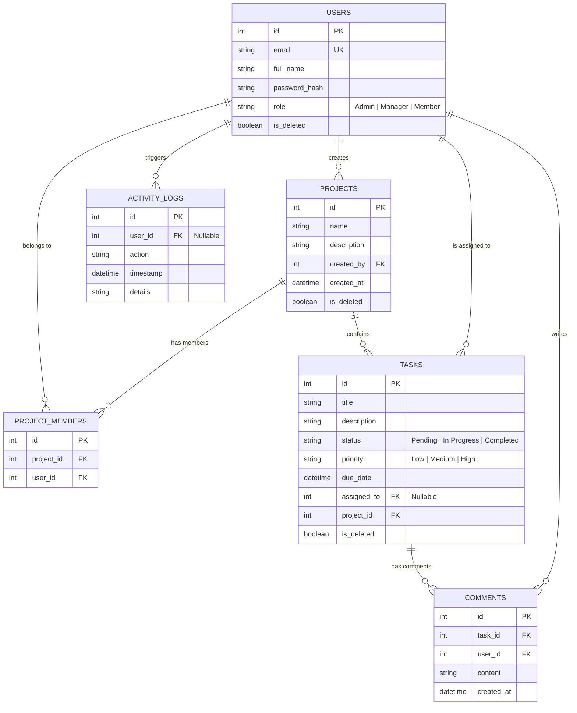

# Project Management API with Role-Based Access Control (RBAC)

A secure, high-performance, and feature-rich FastAPI backend application for managing projects, members, tasks, activity logs, and comments with strict role-based authorization controls.

---

## Features

- **JWT Authentication & Profile Management**: Secure sign-up, login, and profile retrieval.
- **Role-Based Access Control (RBAC)**: Detailed permission check rules for `Admin`, `Manager`, and `Member`.
- **Database Relationships**: Handles many-to-many project memberships and project-task hierarchies.
- **Task Assignment Constraints**: Enforces that tasks can only be assigned to validated project members.
- **Activity logs (Bonus)**: Auditing of all security and data modifications (Admin-only).
- **Task Comments (Bonus)**: Chronological discussions on task items.
- **Analytics Dashboard (Bonus)**: Completeness ratios and task workload distribution per project.
- **Soft Delete (Bonus)**: Standard resources support flag-based logical deletion.
- **Pagination & Filtering (Bonus)**: Query parameters on lists (e.g., filtering tasks by status, priority, assignee).
- **Containerization (Bonus)**: Fully configured `Dockerfile` and `docker-compose.yml` configurations.
- **Unit Testing (Bonus)**: Comprehensive test suite validating authorization matrices.

---

## Technology Stack

- **Core**: [FastAPI](https://fastapi.tiangolo.com/) (Python 3.12+)
- **ORM**: [SQLAlchemy](https://www.sqlalchemy.org/) (v2.0+)
- **Database**: SQLite (local file)
- **Migrations**: [Alembic](https://alembic.sqlalchemy.org/)
- **Security**: PyJWT (jose), Password hashing via standard `bcrypt` (future-proofed for Python 3.14+)
- **Testing**: [Pytest](https://docs.pytest.org/)

---

## Database Design



---

## RBAC Permission Matrix

| Resource | Action | Admin | Manager | Member |
| :--- | :--- | :--- | :--- | :--- |
| **Users** | Manage (Create/List/Edit/Delete) | Yes | No | No |
| **Projects** | Create | Yes | Yes | No |
| **Projects** | Update | Yes | Yes (if owner or project member) | No |
| **Projects** | Delete | Yes | No | No |
| **Projects** | View (List / Detail) | Yes (All) | Yes (Owned / Member of) | Yes (Member of) |
| **Projects** | View Analytics | Yes | Yes (Owned / Member of) | No |
| **Project Members** | Add/Remove Members | Yes | Yes (if owner or project member) | No |
| **Tasks** | Create | Yes | Yes (if project owner/member) | No |
| **Tasks** | Assign / Reassign / Deadlines | Yes | Yes (if project owner/member) | No |
| **Tasks** | Update Status | Yes | Yes (if project owner/member) | Yes (if assigned task) |
| **Tasks** | View | Yes (All) | Yes (Owned / Member projects) | Yes (Assigned tasks / Project member) |
| **Comments** | Add / View | Yes | Yes (if project owner/member) | Yes (if project member) |

---

## Setup & Running Guide

### 1. Prerequisite
- Python 3.12 or newer installed.

### 2. Environment Configurations
A preconfigured `.env` is supplied in the root of the project:
```ini
SECRET_KEY=9a7c36a43dcf8c783fb79698d249f3e49392e22c95e1e4a1a67dc23c2859082a
ALGORITHM=HS256
ACCESS_TOKEN_EXPIRE_MINUTES=60
DATABASE_URL=sqlite:///./project.db
```

### 3. Local Installation
Navigate to the project root and perform the following:
```bash
# 1. Create virtual environment
python -m venv venv

# 2. Activate virtual environment (Windows PowerShell)
.\venv\Scripts\Activate.ps1
# Or (Windows CMD)
.\venv\Scripts\activate.bat
# Or (macOS/Linux)
source venv/bin/activate

# 3. Install packages
pip install -r requirements.txt

# 4. Apply Alembic database migrations
alembic upgrade head

# 5. Launch FastAPI development server
uvicorn app.main:app --reload
```

*Note: On first startup, the application automatically runs a seeding script that inserts default users for testing (listed below).*

---

## Default User Accounts (Auto-Seeded)

The system automatically inserts three test accounts when the application starts for the first time:

1. **Admin User**:
   - Email: `admin@example.com`
   - Password: `AdminPassword123`
2. **Manager User**:
   - Email: `manager@example.com`
   - Password: `ManagerPassword123`
3. **Member User**:
   - Email: `member@example.com`
   - Password: `MemberPassword123`

---

## API Testing & Documentation

### Interactive Swagger Docs
Once the server is running, navigate to:
- Swagger UI: `http://127.0.0.1:8000/docs`
- ReDoc: `http://127.0.0.1:8000/redoc`

You can use the **Authorize** lock button in Swagger UI using any of the default accounts credentials to test authentication scopes.

### Postman Collection
A Postman collection is exported in the root of this project:
`project_management_api.postman_collection.json`

**To run it**:
1. Open Postman, click **Import** and select the file.
2. Under the environment config, the collection uses a `base_url` variable default to `http://127.0.0.1:8000`.
3. Use the `Login (Admin)` or `Login (Manager)` request first. The test script in Postman automatically extracts and sets the `{{token}}` environment variable for all subsequent bearer token requests.

---

## Running Unit Tests

Run the comprehensive pytest suite to validate API validation constraints and authorization:
```bash
python -m pytest
```

---

## Container Setup (Docker)

To run the complete application inside a Docker container:
```bash
# Build and run containers
docker-compose up --build
```
The server will be available at `http://127.0.0.1:8000`.
